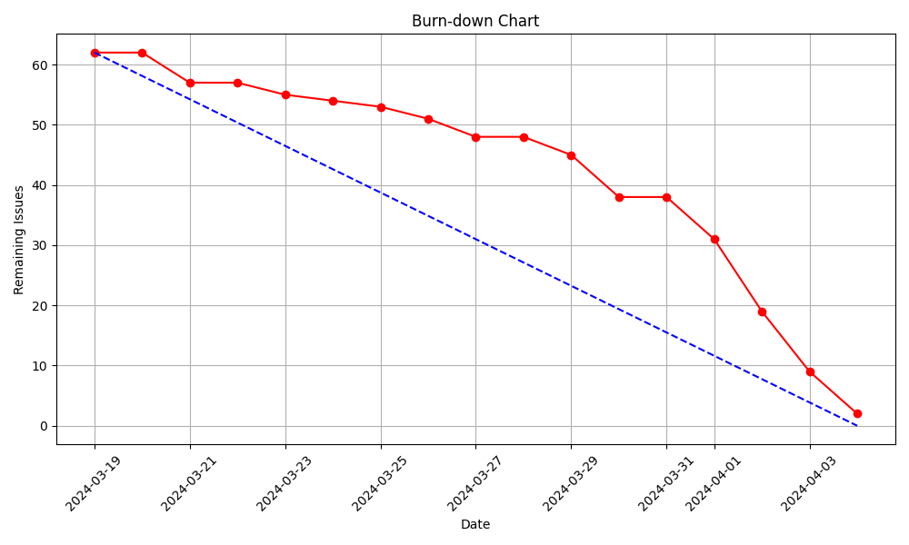
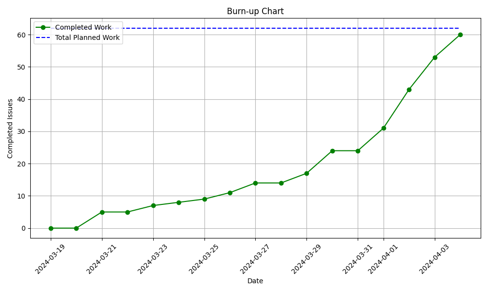

# Sprint 1 - Review (04-04-2024)

## Work Scheduled/Performed

| Action           | Brief Description                                                              | Completed |
|------------------|--------------------------------------------------------------------------------|-----------|
| Logging system   | User authentication system: login, logout and signup.                          | Yes       |
| Room reservation | Enable receptionist to manage and create a reservation for a guest.            | Yes       |
| Check-in         | System to check-in an guest with a given room reservation.                     | Yes       |
| Check-out        | System to check-out a gues with a given room reservation with check-in enabled | Yes       |

## Burn-down Graph

The sprint started with a lot of issues, but the team was able to solve them and deliver the project on time. But there
have been bugs that had to be solved last time. In general the team has started working well but a bit late so the last
days of the sprint had to be worked hard to deliver the project on time.

## Brun-up (Velocity) Graph

The team has started the sprint with a lot of issues and the velocity was low. But the team has worked hard to solve the
issues and deliver the project on time. For the next sprint this should be improved in order to make the line more
linear.

## Client Improvements

For the conclusions we need to reflect improvement points reflected by our customer.

| Client Improvement                 | Description                                                                                                                                                 |
|------------------------------------|-------------------------------------------------------------------------------------------------------------------------------------------------------------|
| Refactor delete reservation button | Reservations must not be completely deleted from the system, they have to remain in the reservation database (log) but hidden from the receptionist worker. |
| Poblate database                   | Project database must be filled with multiple entries to show the client a more realistic view and to test it properly.                                     |