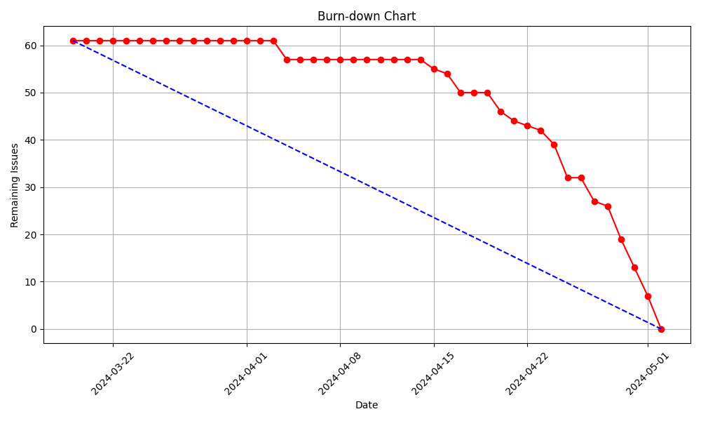
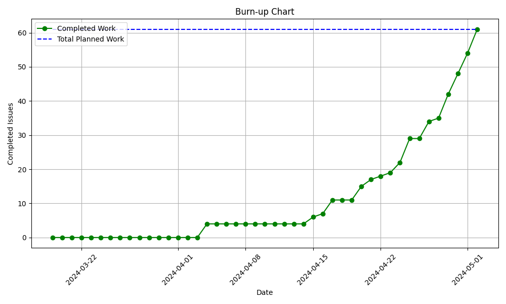

# Sprint 2 - Review (02-05-2024)

## Work Scheduled/Performed

| Action                       | Brief Description                                                                                                                                               | Completed |
|------------------------------|-----------------------------------------------------------------------------------------------------------------------------------------------------------------|-----------|
| Cleaner stock                | Make the cleaner role the ability to mark a cleaning material as out of stock or not.                                                                           | Yes       |
| Cleaner room cleaning        | Cleaner can see the list of the rooms that are not cleaned yet. Once the room is cleaned it can be marked as cleaned and cleaner can add some comments on that. | Yes       |
| Cleaner tests                | Test all the functionalities of the cleaning role.                                                                                                              | Yes       |
| Restaurant reservation       | The restaurant role can create new reservations based on the type of the client.                                                                                | Yes       |
| Restaurant reservation list  | The restaurant role can check the reservations and mark if the client has arrived or not.                                                                       | Yes       |
| Restaurant tests             | Test all the functionalities of the restaurant role.                                                                                                            | Yes       |
| Fix and improve receptionist | Fix most of the problems related on the receptionist role and improve the functionalities.                                                                      | Yes       |

## Burn-down Graph

## Brun-up (Velocity) Graph

## Client Improvements

| Client Improvement               | Description                                                      |
|----------------------------------|------------------------------------------------------------------|
| Manage.py room not clean command | Command to automatically set rooms to not clean                  |
| Manage.py remove data command    | Command to automatically remove data from the db at a given date |
| Restaurant bills                 | Billing of restaurant reservations (Sprint 3)                    |
