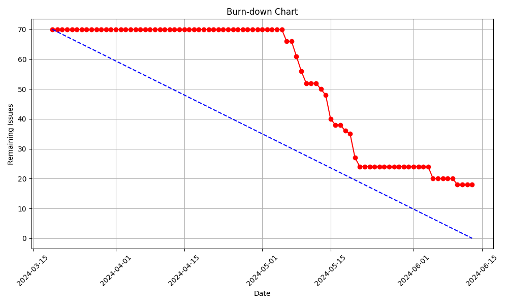
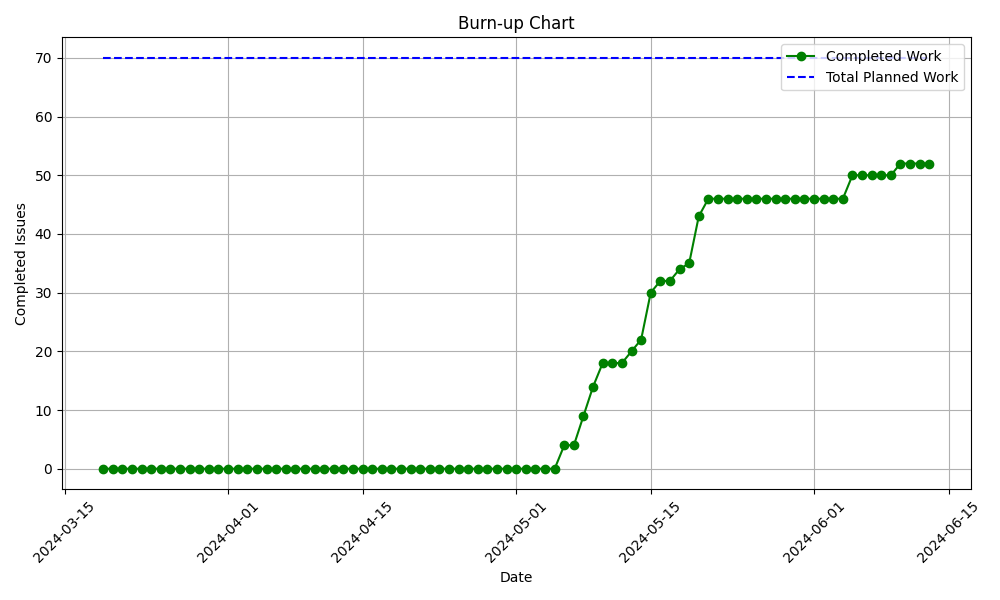

# Sprint 3 - Review (13-06-2024)

## Work Scheduled/Performed

| Action             | Brief Description                                               | Completed |
|--------------------|-----------------------------------------------------------------|-----------|
| Accountant actions | Accountant can check the billing information and extra actions. | No        |
| Planner actions    | Planner can add new workers and extra actions.                  | Yes       |
| User               | User can book an hotel room.                                    | Yes       |

## Burn-down Graph

In this chart it can be seen that it has been only an specified period of working and and most of the time the
development it has been in stand by. This has been caused by external factors that have affected the development of the
project.

## Burn-up (Velocity) Graph

In this chart it can be seen that not all of the issues have been solved at the time of the end of the sprint, but most
of them do.

## Client Improvements

> There are no client improvements since the review it will be done after the release of this sprint on the presentation
> deliverable.

